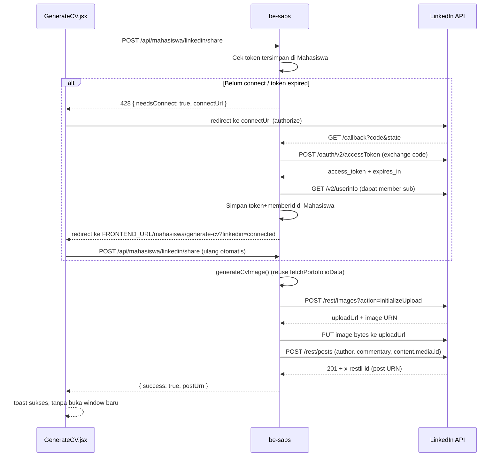

# Share Native ke LinkedIn via OAuth + Posts API

## Kenapa harus ganti pendekatan
Cara sekarang (`buildLinkedInShareUrl` di [be-saps/src/controllers/mahasiswa/cv.controller.ts](be-saps/src/controllers/mahasiswa/cv.controller.ts)) hanya membuka `linkedin.com/feed/?shareActive=true&text=...` — LinkedIn selalu render ini sebagai **link-preview card** (gambar dari `og:image` + judul + domain), tidak pernah sebagai native image post. Untuk gambar CV benar-benar jadi foto post (tanpa card), LinkedIn mewajibkan **Posts API** resmi dengan token OAuth member (`w_member_social`), sesuai app yang sudah Anda buat di LinkedIn Developer Portal.

## Setup manual di LinkedIn Developer Portal (wajib sebelum coding aktif)
1. Tab **Auth** → **Authorized redirect URLs for your app** → tambahkan:
   `https://api.saps.neotelemetri.id/api/mahasiswa/linkedin/callback`
   (dan versi dev, misal `http://localhost:3000/api/mahasiswa/linkedin/callback`, kalau mau tes lokal)
2. Tab **Products** → tambahkan product **"Sign In with LinkedIn using OpenID Connect"** (selain "Share on LinkedIn" yang sudah ada). Ini dibutuhkan supaya bisa panggil `/v2/userinfo` untuk dapat `sub` (member ID) yang dipakai sebagai `author` URN saat posting. Tanpa ini, scope `openid profile` tidak akan di-approve.
3. Catat dari tab **Auth**:
   - Client ID (sudah ada: `8617ud2xpr3sdu`)
   - Client Secret (klik **Show**/**Copy**)
4. Simpan sebagai environment variable baru di server (`.env` be-saps):
   ```
   LINKEDIN_CLIENT_ID="8617ud2xpr3sdu"
   LINKEDIN_CLIENT_SECRET="<dari dashboard>"
   LINKEDIN_REDIRECT_URI="https://api.saps.neotelemetri.id/api/mahasiswa/linkedin/callback"
   LINKEDIN_API_VERSION="202401"
   ```

Catatan penting: access token LinkedIn berlaku ~2 bulan (5184000 detik) dan **tidak auto-refresh** kecuali app di-approve product "Refresh Token" (proses approval terpisah, tidak instan). Jadi setelah ~2 bulan, mahasiswa akan diminta connect ulang — ini locally acceptable untuk fitur share, tidak butuh keep-alive.

## Alur (OAuth + Posting)



## Perubahan database (Prisma)
Tambah 3 kolom nullable ke `Mahasiswa` di [be-saps/prisma/schema.prisma](be-saps/prisma/schema.prisma):

```prisma
model Mahasiswa {
  // ...existing fields...
  linkedinMemberId        String?   @map("linkedin_member_id") @db.VarChar(100)
  linkedinAccessToken     String?   @map("linkedin_access_token") @db.Text
  linkedinTokenExpiresAt  DateTime? @map("linkedin_token_expires_at")
}
```
Jalankan `npx prisma migrate dev --name add_linkedin_oauth_fields` (dev) lalu `npx prisma migrate deploy` di server produksi.

## Backend — file baru & yang diubah

### Baru: `be-saps/src/lib/linkedin.ts`
Helper murni untuk panggilan ke LinkedIn API:
- `buildAuthorizeUrl(state: string): string` — arahkan ke `https://www.linkedin.com/oauth/v2/authorization` dengan `scope=openid%20profile%20w_member_social`
- `exchangeCodeForToken(code: string): Promise<{ accessToken, expiresIn }>` — POST ke `https://www.linkedin.com/oauth/v2/accessToken`
- `fetchMemberId(accessToken: string): Promise<string>` — GET `https://api.linkedin.com/v2/userinfo`, ambil `sub`
- `uploadImageAndPost(params): Promise<string>` — orkestrasi 3 langkah: `initializeUpload` → `PUT` bytes ke presigned URL (tanpa Authorization header) → `POST /rest/posts` dengan `content.media.id`. Pakai `fetch` bawaan Node (tidak perlu tambah dependency HTTP client).

### Baru: `be-saps/src/controllers/mahasiswa/linkedin.controller.ts`
- `connectLinkedIn(req, res)` — GET, authenticated. Generate `state` = JWT pendek (`jwt.sign({ userId, purpose: 'linkedin_oauth' }, JWT_SECRET, { expiresIn: '10m' })`), redirect ke `buildAuthorizeUrl(state)`.
- `linkedinCallback(req, res)` — GET, publik (dipanggil browser redirect dari LinkedIn, tidak bisa bawa header Authorization). Verifikasi `state` sebagai JWT untuk dapat `userId`, tukar `code` jadi token, ambil member id, simpan ke `Mahasiswa` via Prisma, lalu redirect ke `FRONTEND_URL/mahasiswa/generate-cv?linkedin=connected`.
- `shareCvToLinkedIn(req, res)` — POST, authenticated. Ambil mahasiswa; jika `linkedinAccessToken` kosong/expired → balas `428 { success:false, needsConnect:true, connectUrl: '/api/mahasiswa/linkedin/connect' }`. Kalau valid → reuse `fetchPortofolioData` + `generateCvImage` (refactor sedikit di `cv.controller.ts` supaya exportable, atau import langsung) untuk generate buffer PNG, lalu panggil `uploadImageAndPost` dengan commentary = `buildDefaultShareMessage(nama) + '\n\n' + publicCvUrl`. Response `{ success: true, postUrn }`.

### Ubah: `be-saps/src/routes/mahasiswa.routes.ts`
```ts
import { connectLinkedIn, shareCvToLinkedIn } from '../controllers/mahasiswa/linkedin.controller';
router.get('/linkedin/connect', connectLinkedIn);
router.post('/linkedin/share', shareCvToLinkedIn);
```

### Ubah: `be-saps/src/index.ts`
Daftarkan callback publik di root (bukan di bawah `/api/mahasiswa` yang di-guard `authenticateJWT`, karena LinkedIn redirect browser tidak bawa Bearer token):
```ts
app.get('/api/mahasiswa/linkedin/callback', linkedinCallback);
```

### Ubah: `be-saps/.env-example`
Tambahkan dokumentasi 4 variabel baru (`LINKEDIN_CLIENT_ID`, `LINKEDIN_CLIENT_SECRET`, `LINKEDIN_REDIRECT_URI`, `LINKEDIN_API_VERSION`).

## Frontend

### Baru fungsi di `fe-saps/src/services/cvService.js` (atau file baru `linkedinService.js`)
```js
export async function shareCvToLinkedIn() {
  return post('/api/mahasiswa/linkedin/share')
}
export function getLinkedInConnectUrl() {
  return `${getApiBase()}/api/mahasiswa/linkedin/connect`
}
```

### Ubah `fe-saps/src/pages/mahasiswa/GenerateCV.jsx`
- Ganti `handleShareLinkedIn`: panggil `shareCvToLinkedIn()`.
  - Jika sukses → `toast.success('Berhasil diposting ke LinkedIn')`.
  - Jika backend balas `needsConnect` (status 428) → simpan flag "return here" (misal lewat query param, sudah ditangani backend via redirect `?linkedin=connected`) lalu `window.location.href = getLinkedInConnectUrl()` (redirect penuh, bukan popup — karena OAuth LinkedIn butuh full-page redirect untuk consent screen).
- Tambah `useEffect` baca `?linkedin=connected` dari URL saat mount → otomatis panggil `shareCvToLinkedIn()` sekali lagi, lalu bersihkan query param (`history.replaceState`).
- Hapus state `linkedInShareUrl` lama dan pemakaian `getCv().linkedInShareUrl` / `generateCvPublicLink().linkedInShareUrl` untuk tombol ini (link-preview lama tidak dipakai lagi untuk tombol utama). `publicCvUrl` tetap dipertahankan di backend sebagai bagian teks post.

## Yang TIDAK berubah
- Endpoint OG-page (`/cv/public/:token`) dan `image.png` tetap ada — masih berguna sebagai fallback kalau mahasiswa belum connect LinkedIn atau untuk share manual copy-link ke platform lain (WhatsApp, dll).
- `generateCvImage()` di [be-saps/src/lib/cvImage.ts](be-saps/src/lib/cvImage.ts) dipakai apa adanya (sudah menghasilkan gambar CV lengkap).

## Risiko / catatan
- LinkedIn image upload API butuh Content-Type sesuai file (`image/png`) saat `PUT` ke presigned URL.
- `LinkedIn-Version` header wajib di setiap call REST (`/rest/...`), pakai `202401` sesuai product version yang tercantum di app Anda.
- Token disimpan sebagai plaintext di kolom `Text` (opsi paling sederhana). Tidak dienkripsi di level aplikasi — konsisten dengan level keamanan JWT_SECRET yang ada sekarang, bisa ditingkatkan nanti kalau perlu.
