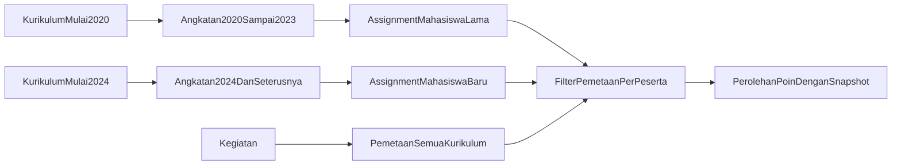

# Implementasi Multi-Kurikulum Berdasarkan Angkatan

## Keputusan domain

- Tambahkan hanya `angkatanMulai` pada `Kurikulum`; tidak ada `angkatanSelesai` karena akhir keberlakuan diturunkan otomatis dari kurikulum berikutnya.
- Untuk angkatan mahasiswa `Y`, pilih kurikulum dengan `angkatanMulai` terbesar yang memenuhi `angkatanMulai <= Y`. Contoh: kurikulum 2020 berlaku untuk angkatan 2020–2023 setelah kurikulum 2024 diterbitkan; kurikulum 2024 berlaku untuk angkatan 2024 dan seterusnya sampai ada kurikulum lebih baru.
- `angkatanMulai` harus unik. Dua kurikulum tidak boleh menjadi versi berlaku utama untuk angkatan mulai yang sama.
- Tambahkan assignment eksplisit `Mahasiswa.kurikulumId`. Assignment disimpan saat mahasiswa dibuat/backfill sehingga kurikulum lama tetap melekat pada mahasiswa lama walaupun kurikulum baru hadir.
- Kurikulum lama tetap aktif selama masih direferensikan mahasiswa yang belum selesai; penonaktifan/arsip ditolak jika masih digunakan.
- Tambahkan snapshot `PerolehanPoin.kurikulumId` agar histori poin tidak berubah jika assignment mahasiswa kelak berubah.
- Pertahankan satu `Kegiatan` dengan pemetaan ke semua kurikulum aktif/yang masih dipakai melalui `KegiatanCapaian`. `Kegiatan.kurikulumId` dijadikan nullable/legacy-default dan tidak lagi dipakai untuk menentukan matriks atau capaian peserta.
- Data historis tidak diremap lintas kurikulum secara otomatis. Backfill menghasilkan laporan konflik; poin baru wajib konsisten.

## 1. Schema, migrasi, dan backfill aman

- Ubah [`prisma/schema.prisma`](/Users/lsd.dsi.unand/Documents/laila/saps/be-saps/prisma/schema.prisma):
  - `Kurikulum.angkatanMulai` dengan unique constraint/index status dan tahun mulai.
  - `Mahasiswa.kurikulumId` beserta relation dan index.
  - `PerolehanPoin.kurikulumId` sebagai snapshot beserta relation dan index.
  - jadikan `Kegiatan.kurikulumId` nullable untuk kompatibilitas data lama.
- Buat migration bertahap dengan kolom nullable terlebih dahulu, FK/index, lalu isi `angkatanMulai` dari konfigurasi yang dapat diverifikasi.
- Ganti fungsi script [`scripts/migrasi-perolehan-kurikulum.ts`](/Users/lsd.dsi.unand/Documents/laila/saps/be-saps/scripts/migrasi-perolehan-kurikulum.ts) menjadi dry-run/apply per mahasiswa: urutkan kurikulum berdasarkan `angkatanMulai` menurun, pilih yang terbaru dengan `angkatanMulai <= mahasiswa.angkatan`, isi assignment/snapshot yang pasti, serta laporkan mahasiswa tanpa angkatan/kurikulum dan detail poin lintas kurikulum.
- Sesuaikan seed/dummy agar rentang dan assignment dibuat secara idempoten.

## 2. Resolver dan invariant terpusat

- Buat [`src/services/kurikulumResolver.service.ts`](/Users/lsd.dsi.unand/Documents/laila/saps/be-saps/src/services/kurikulumResolver.service.ts) berisi:
  - `resolveKurikulumMahasiswa` dengan prioritas assignment eksplisit; bila belum ada, pilih kurikulum aktif terbaru berdasarkan `angkatanMulai <= angkatan` dengan `orderBy angkatanMulai desc`.
  - bulk resolver untuk dashboard/laporan agar tidak N+1.
  - validasi `angkatanMulai` wajib, unik, dan tidak boleh diubah setelah kurikulum sudah dipakai mahasiswa tanpa migrasi eksplisit.
  - helper validasi seluruh `subCapaianId` berada pada kurikulum yang diminta.
- Tidak ada fallback nama, `tahunAkademik.includes`, histori pertama, atau kurikulum aktif pertama tanpa syarat angkatan. Kondisi tidak ada kurikulum yang mulai sebelum/sama dengan angkatan menjadi error domain yang jelas.
- Aktivasi kurikulum di [`kurikulum.controller.ts`](/Users/lsd.dsi.unand/Documents/laila/saps/be-saps/src/controllers/pimpinan/ditmawa/kurikulum.controller.ts) dilakukan transaksional bersama uniqueness/readiness validation dan audit log; arsip ditolak selama masih direferensikan mahasiswa.

## 3. Assignment mahasiswa pada semua jalur tulis

- Perluas create/update kurikulum agar menerima satu `angkatanMulai` dan sediakan update metadata/tahun mulai hanya untuk draft yang belum dipakai.
- Perbarui semua jalur mahasiswa yang tersedia—[`auth.controller.ts`](/Users/lsd.dsi.unand/Documents/laila/saps/be-saps/src/controllers/auth.controller.ts), seed, dan dummy/import script—agar create atau perubahan angkatan menjalankan resolver dalam transaksi dan menyimpan `kurikulumId`.
- Perubahan angkatan mahasiswa yang sudah memiliki poin harus eksplisit dan teraudit; jangan diam-diam menafsirkan ulang histori.
- Kembalikan identitas kurikulum mahasiswa pada endpoint profil/dashboard agar frontend dapat menampilkannya.

## 4. Kegiatan tetap multi-kurikulum, settlement per mahasiswa

- Pertahankan payload gabungan `alokasi[]` dari frontend untuk semua kurikulum aktif.
- Perketat [`kegiatan.controller.ts`](/Users/lsd.dsi.unand/Documents/laila/saps/be-saps/src/controllers/admin/ditmawa/kegiatan.controller.ts): seluruh ID harus valid, berasal dari kurikulum aktif yang diharapkan, tidak duplikat, dan total tepat 100% per kurikulum; hilangkan penentuan authoritative curriculum lewat `findFirst`.
- Refactor [`poin.service.ts`](/Users/lsd.dsi.unand/Documents/laila/saps/be-saps/src/services/poin.service.ts): resolve kurikulum peserta, ambil matriks kurikulum tersebut, filter `KegiatanCapaian` melalui `SubCapaian -> Capaian -> kurikulumId`, validasi total 100%, lalu simpan snapshot pada `PerolehanPoin` dan detail dari kurikulum yang sama saja.
- Gunakan alur settlement terpusat pada internal, klaim eksternal tunggal/bulk, estimasi, dan validasi UKM di [`klaim.controller.ts`](/Users/lsd.dsi.unand/Documents/laila/saps/be-saps/src/controllers/admin/ditmawa/klaim.controller.ts), [`kegiatan.controller.ts`](/Users/lsd.dsi.unand/Documents/laila/saps/be-saps/src/controllers/ukm/kegiatan.controller.ts), serta controller mahasiswa terkait.
- Hapus semua `findFirst({ status: 'aktif' })` yang menentukan kurikulum pada proses bisnis; query status aktif yang hanya menghitung/listing tetap boleh berupa `findMany`/`count`.

## 5. Progres, dashboard, dan laporan

- Pindahkan perhitungan progres dari [`dashboard.controller.ts`](/Users/lsd.dsi.unand/Documents/laila/saps/be-saps/src/controllers/mahasiswa/dashboard.controller.ts) ke service reusable dan filter perolehan/detail berdasarkan snapshot assignment.
- Mahasiswa selalu melihat assignment-nya; dosen/pimpinan dapat memakai `kurikulumId` filter. Agregat lintas kurikulum dihitung per mahasiswa dengan target kurikulumnya, bukan memakai satu target global.
- Terapkan query `kurikulumId` dan validasi scope pada dashboard dosen, Ditmawa, fakultas, pimpinan utama, serta preview/PDF/Excel laporan di [`dataLaporan.service.ts`](/Users/lsd.dsi.unand/Documents/laila/saps/be-saps/src/services/laporan/dataLaporan.service.ts) dan controller terkait.
- Metadata respons menyertakan kurikulum/rentang yang digunakan agar angka dapat diaudit.

## 6. Frontend konsisten dan eksplisit

- Ikuti konvensi frontend SAPS saat mengubah komponen UI.
- Normalisasi [`getKurikulumAktif()`](/Users/lsd.dsi.unand/Documents/laila/saps/fe-saps/src/services/kurikulumService.js) agar selalu mengembalikan array; tambahkan parameter `kurikulumId` pada service matriks, dashboard, dan laporan.
- Tambahkan satu input “Mulai Berlaku untuk Angkatan” dan validasi tahun mulai unik pada [`ManajemenKurikulum.jsx`](/Users/lsd.dsi.unand/Documents/laila/saps/fe-saps/src/pages/pimpinan_ditmawa/ManajemenKurikulum.jsx); tampilkan cakupan turunan seperti “2020–2023” atau “2024 dan seterusnya” berdasarkan urutan kurikulum, lalu seragamkan field pada [`TambahMatriks.jsx`](/Users/lsd.dsi.unand/Documents/laila/saps/fe-saps/src/pages/pimpinan_ditmawa/TambahMatriks.jsx).
- Tambahkan selector kurikulum pada [`BobotPoin.jsx`](/Users/lsd.dsi.unand/Documents/laila/saps/fe-saps/src/pages/pimpinan_ditmawa/BobotPoin.jsx), [`LaporanPimpinan.jsx`](/Users/lsd.dsi.unand/Documents/laila/saps/fe-saps/src/pages/pimpinan/LaporanPimpinan.jsx), dan dashboard dosen/pimpinan; selector mengontrol seluruh kartu, tabel, grafik, preview, PDF, dan Excel secara atomik.
- Dashboard mahasiswa menampilkan kurikulum assignment secara read-only, bukan memberi pilihan arbitrer.
- Jangan tambahkan single-select pada form kegiatan. [`PemetaanCapaianKurikulumSection.jsx`](/Users/lsd.dsi.unand/Documents/laila/saps/fe-saps/src/components/PemetaanCapaianKurikulumSection.jsx) tetap menampilkan semua kurikulum aktif dan memvalidasi 100% per kurikulum; bersihkan state `selectedKurikulumIds` yang saat ini tidak efektif.

## 7. Verifikasi dan rollout

- Tambahkan test backend untuk pemilihan kurikulum terbaru pada batas tahun mulai, assignment eksplisit, angkatan sebelum kurikulum pertama, uniqueness `angkatanMulai`, larangan arsip kurikulum yang masih dipakai, settlement peserta beda kurikulum pada kegiatan yang sama, penolakan detail lintas kurikulum, filter progres, dan laporan campuran.
- Jalankan Prisma generate/migration pada database pengembangan, dry-run backfill berdasarkan urutan `angkatanMulai` dan tinjau laporan konflik sebelum `--apply`.
- Jalankan build/lint kedua repositori dan smoke test API untuk dua mahasiswa beda angkatan dalam satu kegiatan; pastikan poin memakai matriks dan sub-capaian masing-masing tanpa mengubah mapping kegiatan bersama.